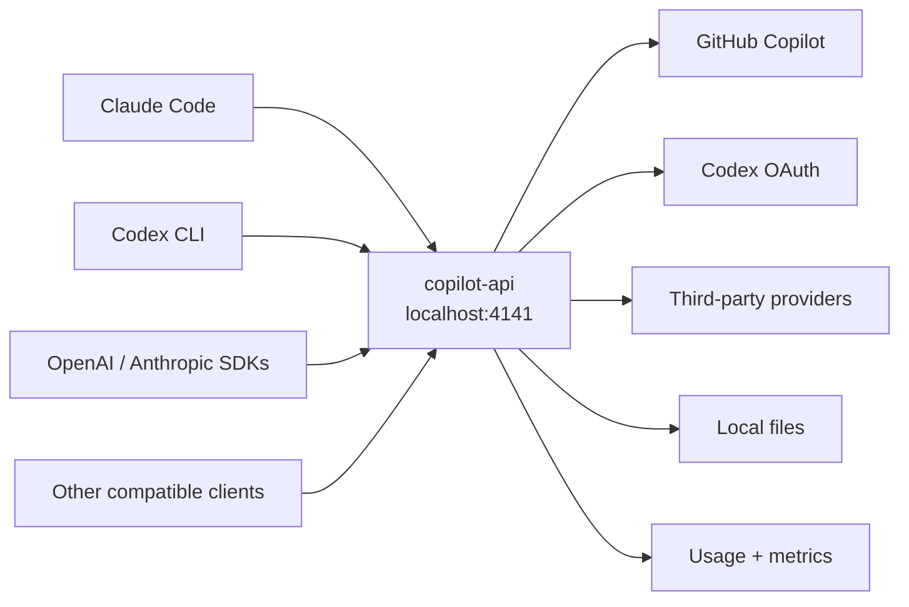

<div align="center">

# copilot-api

**One local gateway for GitHub Copilot, Claude Code, Codex CLI, and OpenAI-compatible clients.**

Expose OpenAI- and Anthropic-compatible APIs from a native Rust service, then
route each request to GitHub Copilot, Codex, or a provider you configure.

[](https://github.com/Arthur742Ramos/copilot-api-rust/actions/workflows/ci.yml)
[](https://crates.io/crates/copilot-api)
[](https://github.com/Arthur742Ramos/copilot-api-rust/releases/latest)
[](./LICENSE)
[](https://www.rust-lang.org/)

[Quick start](#quick-start) |
[Connect a client](#connect-your-client) |
[Features](#what-you-get) |
[Configuration](#configuration) |
[API reference](#api-reference) |
[Security](#security)

</div>

---

`copilot-api` lets existing AI tools talk to a local endpoint while the gateway
handles authentication, model discovery, protocol translation, streaming, tool
calls, provider routing, and usage accounting.

It began as an independent Rust reimplementation of
[`caozhiyuan/copilot-api`](https://github.com/caozhiyuan/copilot-api) and now
evolves independently. See [`NOTICE.md`](./NOTICE.md) for attribution.

> [!IMPORTANT]
> This is unofficial community software. It is not affiliated with or endorsed
> by GitHub, Microsoft, OpenAI, or Anthropic. Review the
> [disclaimer](#disclaimer) and use the project responsibly.

## What you get

| Capability | What it unlocks |
| --- | --- |
| **OpenAI compatibility** | Chat Completions, Responses, compaction, models, embeddings, images, and a local Files API. |
| **Anthropic compatibility** | Messages, token counting, streaming, thinking blocks, tools, prompt caching, images, PDFs, and local file references. |
| **Coding-agent support** | Audited integration paths for Claude Code and Codex CLI, including their current headers, request shapes, and SSE lifecycles. |
| **Backend choice** | Use GitHub Copilot, Codex OAuth, Anthropic, OpenAI-compatible APIs, Responses-compatible APIs, or your own provider aliases. |
| **Local control** | API keys, admin routes, model mappings, token budgets, rate limits, load shedding, and provider-only mode. |
| **Operational visibility** | Readiness and version endpoints, Prometheus metrics, structured logs, diagnostics, and a built-in usage dashboard. |
| **Simple distribution** | Install from crates.io, download a release binary, build from source, or run the published container image. |

## How it fits together



Clients keep using familiar APIs. The gateway resolves the requested model,
selects the right upstream transport, translates the request and streaming
response, and preserves the client-facing protocol.

## Quick start

### 1. Install

With Cargo:

```sh
cargo install copilot-api --locked
```

Or download a prebuilt binary from the
[latest release](https://github.com/Arthur742Ramos/copilot-api-rust/releases/latest).
Release assets are published for Linux x86-64, macOS Apple Silicon, and Windows
x86-64.

### 2. Start the gateway

```sh
copilot-api start
```

On first run, `copilot-api` starts GitHub's device-login flow, opens the
authorization page when possible, stores the token in your local app-data
directory, and loads the models available to your account.

The server listens on `http://127.0.0.1:4141` by default.

### 3. Confirm it is ready

In another terminal:

```sh
curl -fsS http://127.0.0.1:4141/readyz
curl -fsS http://127.0.0.1:4141/v1/models
```

### 4. Send a request

Choose a model ID returned by `/v1/models`, replace `MODEL_ID`, and call the
OpenAI-compatible endpoint:

```sh
curl http://127.0.0.1:4141/v1/chat/completions \
  -H "content-type: application/json" \
  -d '{
    "model": "MODEL_ID",
    "messages": [
      {"role": "user", "content": "Explain why Rust is useful for API gateways."}
    ]
  }'
```

That is the complete local path: authenticate once, start one process, and point
your client at it.

## Connect your client

The most common setup difference is whether the client expects `/v1` in its base
URL:

| Client | Base URL | Client credential |
| --- | --- | --- |
| OpenAI SDKs and compatible apps | `http://127.0.0.1:4141/v1` | Any non-empty value by default; a configured `auth.apiKeys` value when auth is enabled. |
| Claude Code and Anthropic SDKs | `http://127.0.0.1:4141` | Any non-empty `ANTHROPIC_AUTH_TOKEN` by default; a configured key when auth is enabled. |
| Codex CLI | `http://127.0.0.1:4141/v1` | `COPILOT_API_KEY`, using the same rule as other client credentials. |

### Claude Code

The guided setup asks you to choose primary and small models, then prints and
copies a ready-to-run Claude Code command:

```sh
copilot-api start --claude-code
```

For manual setup:

```sh
export ANTHROPIC_BASE_URL="http://127.0.0.1:4141"
export ANTHROPIC_AUTH_TOKEN="local"
export ANTHROPIC_MODEL="MODEL_ID"
export CLAUDE_CODE_ENABLE_GATEWAY_MODEL_DISCOVERY="1"
claude
```

Replace `MODEL_ID` with a model from `/v1/models`. If you configure
`auth.apiKeys`, replace `local` with one of those keys.

Claude Code normally imports only gateway model IDs beginning with `claude` or
`anthropic`. To add every picker-enabled Copilot chat model to `/model`, enable
reversible compatibility aliases in `config.json`:

```json
{
  "claudeCodeModelDiscoveryAliases": true
}
```

Reload or restart `copilot-api`, then restart Claude Code. Non-Claude entries
appear as `claude-copilot:<model-id>` aliases and resolve back to the real model
before upstream dispatch. Their picker labels include the Copilot context window
and supported reasoning efforts. Claude Code only understands its built-in 200K
and 1M context tiers: aliases for models with at least 1M context use `[1m]`;
other context sizes are displayed accurately but cannot change Claude Code's
internal context budget. A model can always be selected directly with
`/model <model-id>` even when compatibility aliases are disabled.

The detailed [Claude Code compatibility contract](./docs/claude-code-api-compatibility.md)
documents supported content blocks, tools, thinking, streaming behavior, error
semantics, and explicit limits.

### Codex CLI

Add a custom provider to `~/.codex/config.toml`:

```toml
model = "gpt-5.4"
model_provider = "copilot_api"

[model_providers.copilot_api]
name = "copilot_api"
base_url = "http://127.0.0.1:4141/v1"
env_key = "COPILOT_API_KEY"
wire_api = "responses"
```

Then launch Codex:

```sh
export COPILOT_API_KEY="local"
codex
```

The public Responses WebSocket transport is not exposed, so leave
`supports_websockets` unset or `false`. The
[combined Claude Code and Codex guide](./docs/claude-code-codex-compatibility.md)
contains the audited client versions, headers, request shapes, compaction
behavior, and reproducible test evidence.

### OpenAI SDKs

Any client that supports a custom OpenAI base URL can use the gateway. For
example, with the Python SDK:

```python
from openai import OpenAI

client = OpenAI(
    base_url="http://127.0.0.1:4141/v1",
    api_key="local",
)

response = client.chat.completions.create(
    model="MODEL_ID",
    messages=[{"role": "user", "content": "Say hello in one sentence."}],
)

print(response.choices[0].message.content)
```

Use a model returned by `/v1/models`. The same base URL works for clients using
the Responses API.

## Install and run

### Prebuilt releases

The [Releases page](https://github.com/Arthur742Ramos/copilot-api-rust/releases)
contains native binaries for:

- Linux x86-64
- macOS Apple Silicon
- Windows x86-64

Place the binary on your `PATH`, then run `copilot-api start`.

### Cargo

Install the published crate:

```sh
cargo install copilot-api --locked
```

Rust 1.82 or newer is required.

### Build from source

```sh
git clone https://github.com/Arthur742Ramos/copilot-api-rust.git
cd copilot-api-rust
cargo build --release --locked
```

The binary is written to `target/release/copilot-api` (or
`target\release\copilot-api.exe` on Windows).

### Docker

The published image persists tokens and configuration under `/data`. This
local-only example binds the host port to loopback:

```sh
docker pull ghcr.io/arthur742ramos/copilot-api-rust:latest
docker volume create copilot-api-data

# Authenticate once.
docker run -it --rm \
  -v copilot-api-data:/data \
  ghcr.io/arthur742ramos/copilot-api-rust:latest auth

# Start the gateway.
docker run --rm \
  -p 127.0.0.1:4141:4141 \
  -e COPILOT_API_ALLOW_REMOTE_NO_KEY=true \
  -v copilot-api-data:/data \
  ghcr.io/arthur742ramos/copilot-api-rust:latest
```

The explicit `COPILOT_API_ALLOW_REMOTE_NO_KEY=true` is needed because the process
binds `0.0.0.0` inside the container. Publishing the port only on
`127.0.0.1` keeps this example local to the host. For any network-accessible
deployment, configure `auth.apiKeys` instead of using that override.

A [`Dockerfile`](./Dockerfile) and [`docker-compose.yml`](./docker-compose.yml)
are included for source builds and customized deployments. The container
healthcheck probes `/readyz`.

### Update an installed binary

```sh
copilot-api update          # check and ask before replacing the binary
copilot-api update --yes    # update without prompting
copilot-api update --check  # check only
```

The updater verifies the latest GitHub release and atomically replaces the
current executable on supported release platforms. Restart the process
afterward. Container users should pull a newer image instead.

## Highlights

### Protocol translation that goes beyond text

The gateway handles:

- JSON and SSE streaming responses
- tool definitions, tool choice, parallel calls, and fragmented arguments
- Anthropic thinking blocks and OpenAI reasoning items
- prompt caching and `cache_control`
- text, image, PDF, and tool-result content
- OpenAI Responses continuation items and remote compaction
- safe, SDK-recognizable error envelopes
- unknown JSON fields where the destination protocol can represent them

The compatibility guides document where translation is exact, where it is a
deliberate safety improvement, and where a feature is out of scope.

### Route models to the backend you want

Configure Anthropic, OpenAI-compatible, or Responses-compatible providers, then
address a model as `provider/model`:

```text
team-openai/gpt-5
research-anthropic/claude-sonnet-4-6
```

The provider prefix selects credentials and transport; only the model suffix is
sent upstream. You can also remap model IDs globally with `modelMappings`, or
start without GitHub authentication in provider-only mode:

```sh
copilot-api start --provider-only team-openai
```

### Keep files local

Copilot does not expose a Files API, so this project provides an owner-scoped
local implementation backed by SQLite metadata and local storage. Upload once,
then reference the returned `file_id` from Anthropic Messages or OpenAI
Responses. Supported references are expanded to inline data immediately before
dispatch; only the inline content reaches the selected provider.

### Operate it like a service

| Surface | Purpose |
| --- | --- |
| `/readyz` | Readiness probe for orchestration and startup checks. |
| `/version` | Crate version, git SHA, and build timestamp. |
| `/metrics` | Prometheus metrics for requests, upstreams, retries, quotas, and concurrency. |
| `/usage-viewer` | Self-contained browser dashboard for local token usage. |
| `copilot-api doctor` | Secret-free auth, config, and provider preflight with a non-zero failure exit code. |
| `copilot-api debug` | Environment, provider, and path diagnostics; supports JSON output. |

Structured JSON logs are available with `COPILOT_API_LOG_FORMAT=json`; use
`RUST_LOG` for filtering.

## MCP bridge

The `mcp` subcommand runs a stdio MCP server with:

- `search` for loading deferred tools through the gateway's tool-search bridge
- `generate_image` for Codex-backed image generation, returning both inline
  image content and a saved local file

Register it with Claude Code:

```sh
claude mcp add copilot-api -- copilot-api mcp
```

Release-ready Claude Code marketplace plugins and the OpenCode marker/config
assets are in [`plugin/`](./plugin/README.md). They preserve subagent identity
and register the same deferred `tool_search` bridge without machine-specific
paths.

Image generation requires Codex credentials:

```sh
copilot-api auth --provider codex
```

The image path uses an undocumented Codex backend and can change without notice.

## Configuration

Run `copilot-api auth` in a terminal for guided Copilot, Codex, DeepSeek,
DashScope, OpenRouter, OpenCode Go, or custom provider setup. Built-in Copilot
and Codex OAuth fail immediately without a TTY; preconfigured services reuse
their protected credentials instead of invoking `auth`. Non-interactive custom
provider automation uses `--api-key-env`; the secret is written to the
owner-only credential store rather than `config.json`:

```sh
export TEAM_OPENAI_KEY='set-at-runtime'
copilot-api auth --provider custom --name team-openai \
  --type openai-responses --base-url https://provider.example.com \
  --api-key-env TEAM_OPENAI_KEY --model gpt-example \
  --capability responses,responses_compact,models,alpha_search
```

On first run, the gateway creates `config.json` in its platform-specific app-data
directory. Run `copilot-api debug` to print the exact paths in use, or override
the directory with:

```sh
copilot-api --api-home /path/to/data start
# or
export COPILOT_API_HOME="/path/to/data"
```

The GitHub token, Codex credentials, local files, and usage database live under
the same app-data directory.

### Core schema

The generated file contains more model defaults; these are the fields most users
customize:

```jsonc
{
  "auth": {
    "apiKeys": ["replace-with-a-random-client-key"],
    "adminApiKey": "generated-automatically"
  },
  "providers": {
    "team-openai": {
      "type": "openai-compatible",
      "enabled": true,
      "baseUrl": "https://provider.example.com",
      "authType": "authorization",
      "capabilities": ["messages", "count_tokens", "models", "chat_completions", "responses", "responses_compact", "images", "alpha_search"],
      "models": {
        "gpt-responses": {
          "type": "openai-responses"
        }
      }
    }
  },
  "modelMappings": {
    "friendly-model": "team-openai/upstream-model-id"
  },
  "smallModel": "gpt-5-mini",
  "claudeCodeModelDiscoveryAliases": false,
  "modelReasoningEfforts": {
    "gpt-5.4": "high"
  },
  "extraPrompts": {},
  "anthropicApiKey": "optional-token-counting-only",
  "dailyTokenBudget": 5000000,
  "imageChatModel": "gpt-5.5",
  "imageModel": "gpt-image-2"
}
```

Notes:

- `adminApiKey` is generated automatically and always protects `/admin/*`.
- Provider types are `anthropic`, `openai-compatible`, and
  `openai-responses`.
- Provider API keys created by `copilot-api auth` live in the protected
  `provider_credentials.json` store. Existing inline `apiKey` configuration
  remains readable for backward compatibility; new setup does not write it.
- Credential/config writes are owner-only from file creation onward: verified
  `0600` on Unix and a protected single-user DACL on Windows. Unsupported
  platforms or ACL failures fail closed before secrets/config are read or
  written.
- `capabilities` is optional. When absent, conservative defaults are derived
  from the provider type; unsupported routes fail before upstream dispatch.
- A model can override its provider protocol with
  `models.<model>.type`. Capability checks, endpoint selection, and default auth
  mode use this effective type; unknown model fields and future type values are
  preserved, with unsupported type values falling back to the provider type.
- The provider name `copilot` is reserved.
- `claudeCodeModelDiscoveryAliases` is disabled by default. Enable it only when
  Claude Code's `/model` picker should include non-Claude Copilot models.
- Unknown configuration keys are preserved when the file is round-tripped.
- `dailyTokenBudget` rejects new work with `429` after the recorded local-day
  total reaches the configured guardrail. In-flight requests can overshoot it.
- `POST /v1/images/generations` and `/v1/images/edits` proxy the native Codex
  Images API using Codex OAuth credentials. Generation requests default an
  omitted `model` from `imageModel`; edits preserve multipart content types and
  bytes. The MCP `generate_image` tool still uses `imageChatModel` and
  `imageModel` through Responses so it can save the returned image locally.

### Exact Claude token counts

Set `anthropicApiKey` or `ANTHROPIC_API_KEY` to use Anthropic's free
`count_tokens` endpoint for exact Claude counts:

```sh
export ANTHROPIC_API_KEY="..."
```

The key is used only by `POST /v1/messages/count_tokens`; model generation still
uses the selected Copilot or configured-provider route. Without it, Claude token
counts use a local approximation.

## Security

> [!WARNING]
> Local client authentication is disabled by default. Keep the default loopback
> bind unless you configure API keys.

The safe default is `127.0.0.1:4141`, which is reachable only from the same
machine. If `auth.apiKeys` is empty, local requests may use any credential value
and `GET /token` can return the live Copilot bearer token.

The server **refuses to bind a non-loopback address without API keys** unless you
explicitly pass `--allow-remote-no-key`. For LAN, container, or hosted use:

1. Set one or more strong random values in `auth.apiKeys`.
2. Send a matching value with `Authorization: Bearer <key>` or `x-api-key`.
3. Restrict the port with a firewall or private network.
4. Add TLS at a trusted reverse proxy when traffic leaves the host.
5. Never expose `/token` to untrusted clients.

Admin routes always require the separately generated `auth.adminApiKey`.

## API reference

<details>
<summary><strong>CLI commands and flags</strong></summary>

### Commands

| Command | Description |
| --- | --- |
| `start` | Start the API gateway. |
| `auth` | Authenticate without starting the server. |
| `check-usage` | Show current GitHub Copilot usage and quota information. |
| `debug` | Print secret-free environment, provider, and path diagnostics. |
| `doctor` | Run auth, config, and provider preflight checks. |
| `mcp` | Start the MCP bridge over stdio. |
| `update` | Update a release binary in place. |
| `completions <SHELL>` | Generate bash, zsh, fish, elvish, or PowerShell completions. |

### Global flags

| Flag | Description |
| --- | --- |
| `--api-home <PATH>` | Override the app-data directory. |
| `--oauth-app <NAME>` | Override the GitHub OAuth app identifier. |
| `--enterprise-url <URL>` | Set the GitHub Enterprise URL. |

### `start` flags

| Flag | Alias | Default | Description |
| --- | --- | --- | --- |
| `--port <PORT>` | `-p` | `4141` | Listen port. Env: `COPILOT_API_PORT`. |
| `--host <HOST>` | `-H` | `127.0.0.1` | Listen IP or `localhost`. Env: `COPILOT_API_HOST`. |
| `--verbose` | `-v` | `false` | Enable debug logging. |
| `--account-type <TYPE>` | `-a` | `individual` | `individual`, `business`, or `enterprise`. |
| `--manual` | | `false` | Require manual request approval. |
| `--rate-limit <SECONDS>` | `-r` | none | Minimum interval between requests. |
| `--max-concurrent-requests <COUNT>` | | unlimited | Fail-fast cap for upstream-facing requests. |
| `--wait` | `-w` | `false` | Wait instead of immediately failing at the rate limit. |
| `--github-token <TOKEN>` | `-g` | none | Supply a GitHub token non-interactively. |
| `--claude-code` | `-c` | `false` | Generate a Claude Code launch command. |
| `--show-token` | | `false` | Print fetched and refreshed provider tokens. |
| `--proxy-env` | | `false` | Initialize outbound HTTP proxy settings from environment variables. |
| `--allow-remote-no-key` | | `false` | Explicitly allow non-loopback binding with no client API keys. |
| `--provider-only <NAME>` | | none | Skip Copilot auth and route all traffic to one configured provider. |

### `auth` flags

| Flag | Default | Description |
| --- | --- | --- |
| `--provider <NAME>` | guided in TTY; built-in OAuth fails outside TTY | Authenticate or configure `copilot`, `codex`, `opencode-go`, `deepseek`, `dashscope`, `openrouter`, or `custom`. |
| `--name <NAME>` | none | Name a custom provider. |
| `--type <TYPE>` | provider default | `anthropic`, `openai-compatible`, or `openai-responses`. |
| `--base-url <URL>` | provider default | Provider base URL; credentials/query/fragment are rejected. |
| `--auth-type <TYPE>` | protocol default | `x-api-key` or `authorization`. |
| `--api-key-env <NAME>` | provider-specific variable | Read the provider key without exposing it in argv/config. |
| `--model <NAME>` | none | Model choice; repeat or use commas. |
| `--capability <NAME>` | protocol defaults | Explicit endpoint capabilities; repeat or use commas. |
| `--probe` | `false` | Run the bounded provider health probe after setup. |
| `--verbose` / `-v` | `false` | Enable debug logging. |
| `--show-token` | `false` | Print the provider access token. |

### `update` flags

| Flag | Description |
| --- | --- |
| `--check` | Check for a newer release without changing the binary. |
| `--yes` / `-y` | Update without a confirmation prompt. |

</details>

<details>
<summary><strong>Environment variables</strong></summary>

| Variable | Purpose |
| --- | --- |
| `COPILOT_API_HOME` | App-data, token, config, file, and usage storage directory. |
| `COPILOT_API_PORT` | Listen port. |
| `COPILOT_API_HOST` | Listen interface. |
| `COPILOT_API_ACCOUNT_TYPE` | `individual`, `business`, or `enterprise`. |
| `COPILOT_API_GITHUB_TOKEN` | GitHub token for non-interactive startup. |
| `COPILOT_API_OAUTH_APP` | GitHub OAuth app identifier. |
| `COPILOT_API_ENTERPRISE_URL` | GitHub Enterprise URL. |
| `COPILOT_API_MANUAL` | Enable manual request approval. |
| `COPILOT_API_RATE_LIMIT` | Minimum seconds between requests. |
| `COPILOT_API_WAIT` | Wait when the rate limit is reached. |
| `COPILOT_API_MAX_CONCURRENT_REQUESTS` | Fail-fast cap on upstream-facing requests; `64` is a practical desktop starting point. |
| `COPILOT_API_RATE_LIMIT_MAX_WAITERS` | Maximum queued rate-limit waiters. |
| `COPILOT_API_RATE_LIMIT_MAX_WAIT_SECS` | Maximum projected wait before returning `429`. |
| `COPILOT_API_ALLOW_REMOTE_NO_KEY` | Allow non-loopback binding with no API keys. |
| `COPILOT_API_PROVIDER_ONLY` | Route all traffic through one configured provider. |
| `COPILOT_API_PROVIDER_<NAME>_API_KEY` | Provider credential used by non-interactive auth/runtime resolution (`<NAME>` uppercased with punctuation as `_`). |
| `COPILOT_API_PROVIDER_API_KEY` | Generic fallback credential for non-interactive provider setup. |
| `COPILOT_API_LOG_FORMAT` | Set `json` for structured logs. |
| `RUST_LOG` | Logging filter, such as `copilot_api=debug,hyper=warn`. |
| `ANTHROPIC_API_KEY` | Optional exact Claude token counting only. |
| `COPILOT_API_TOKEN_USAGE_RETENTION_DAYS` | Usage-event retention; default `45`, non-positive disables pruning. |
| `COPILOT_API_FILE_MAX_BYTES` | Maximum single local file upload; default 20 MiB. |
| `COPILOT_API_FILE_MAX_OWNER_BYTES` | Maximum stored bytes per API-key identity; default 512 MiB. |
| `COPILOT_API_FILE_MAX_OWNER_COUNT` | Maximum files per API-key identity; default and hard ceiling `1000`. |
| `COPILOT_API_FILE_RETENTION_DAYS` | Local-file retention; default `30`, `0` disables expiry. |
| `COPILOT_API_UPSTREAM_READ_TIMEOUT_SECS` | Upstream stream silence timeout; default `600`, `0` disables it. |
| `COPILOT_API_SSE_HEARTBEAT_SECS` | Idle interval for SSE keepalives; default `15`, `0` disables them. |
| `COPILOT_API_UPSTREAM_RETRY_5XX` | Retry transient 5xx responses on non-billable routes; generation routes are never retried. |

The deprecated `COPILOT_API_MAX_IN_FLIGHT` variable remains a fallback for the
concurrency setting.

</details>

<details>
<summary><strong>HTTP endpoints</strong></summary>

| Method | Path | Description |
| --- | --- | --- |
| `GET` | `/` | Liveness response. |
| `GET` | `/readyz` | Readiness probe. |
| `GET` | `/version` | Build version, git SHA, and timestamp. |
| `GET` | `/metrics` | Prometheus metrics. |
| `GET` | `/usage-viewer` | Built-in usage dashboard. |
| `GET` | `/usage` | Current Copilot usage data. |
| `GET` | `/token` | Live Copilot bearer token; protect this route. |
| `GET` | `/token-usage/*` | Usage summary, daily, events, sessions, and client views. |
| `GET` | `/models`, `/v1/models` | List available models. |
| `GET` | `/models/:id`, `/v1/models/:id` | Retrieve one model. |
| `POST` | `/chat/completions`, `/v1/chat/completions` | OpenAI Chat Completions. |
| `POST` | `/responses`, `/v1/responses` | OpenAI Responses. |
| `POST` | `/responses/compact`, `/v1/responses/compact` | Responses compaction used by Codex CLI. |
| `POST` | `/alpha/search`, `/v1/alpha/search` | Codex Alpha Search. |
| `POST` | `/embeddings`, `/v1/embeddings` | OpenAI-compatible embeddings. |
| `POST` | `/images/generations`, `/v1/images/generations` | Native Codex-backed OpenAI image generation. |
| `POST` | `/images/edits`, `/v1/images/edits` | Native Codex-backed multipart image edits. |
| `POST` | `/v1/messages` | Anthropic Messages. |
| `POST` | `/v1/messages/count_tokens` | Anthropic token counting. |
| `GET`, `POST` | `/files`, `/v1/files` | List or upload local files. |
| `GET`, `DELETE` | `/files/:id`, `/v1/files/:id` | Retrieve metadata or delete a local file. |
| `GET` | `/files/:id/content`, `/v1/files/:id/content` | Download local file content. |
| `GET`, `POST` | `/admin/config/model-mappings` | Read or update model mappings. |
| `GET` | `/admin/config` | Read secret-redacted effective configuration. |
| `GET`, `POST` | `/admin/config/providers` | List or upsert providers. |
| `GET` | `/admin/providers/health` | Probe enabled providers. |
| `POST` | `/admin/config/reload` | Reload `config.json` without restarting. |
| `POST` | `/:provider[/v1]/messages` | Provider-routed Anthropic Messages. |
| `POST` | `/:provider[/v1]/messages/count_tokens` | Provider-routed token counting. |
| `POST` | `/:provider[/v1]/chat/completions` | Provider-routed Chat Completions. |
| `POST` | `/:provider[/v1]/responses` | Provider-routed Responses. |
| `POST` | `/:provider[/v1]/responses/compact` | Provider-routed Responses compaction. |
| `POST` | `/:provider[/v1]/alpha/search` | Provider-routed Alpha Search. |
| `GET` | `/:provider[/v1]/models` | Provider-routed model discovery. |
| `POST` | `/:provider[/v1]/images/generations` | Provider-routed image generation. |
| `POST` | `/:provider[/v1]/images/edits` | Provider-routed multipart image edits. |

General API-key auth applies to proxy, token, metrics, usage, and file routes.
Admin endpoints additionally require `auth.adminApiKey`.

</details>

## Compatibility and limits

- Available Copilot models depend on your account, plan, region, and GitHub's
  current rollout.
- Anthropic compatibility targets Messages, token counting, models, and local
  file references; this is not an emulator for every Anthropic product API.
- The public OpenAI Responses WebSocket transport is not exposed. Clients use
  HTTP/SSE; Codex-backed streams may use the pooled upstream WebSocket with
  pre-send-only fallback and strict terminal accounting.
- Local Files API IDs are expanded before dispatch; provider-hosted file IDs and
  Anthropic `container_upload` blocks are not supported.
- Exact Claude token counts require an Anthropic key. Without one, counts are
  suitable estimates rather than billing authority.
- Native image generation and edits require `copilot-api auth --provider codex`
  and use undocumented Codex endpoints that may change.
- Compatibility is tested without consuming live quota. Live provider
  availability, model quality, and rollout timing remain upstream concerns.

See:

- [Claude Code / Anthropic API compatibility](./docs/claude-code-api-compatibility.md)
- [Claude Code and Codex CLI compatibility](./docs/claude-code-codex-compatibility.md)
- [Non-GUI endpoint/provider audit](./docs/non-gui-compatibility.md)
- [Claude Code and OpenCode plugin integration](./plugin/README.md)

## Contributing

Contributions that improve correctness, compatibility, performance, safety, or
documentation are welcome. Start with [`CONTRIBUTING.md`](./CONTRIBUTING.md).

The local quality gates are:

```sh
cargo fmt
cargo clippy --all-targets -- -D warnings
cargo build
cargo test
```

If the project saves you setup time, a
[GitHub star](https://github.com/Arthur742Ramos/copilot-api-rust) helps other
developers discover it.

## Acknowledgements

This project is a Rust port of
[`caozhiyuan/copilot-api`](https://github.com/caozhiyuan/copilot-api), published
on npm as `@jeffreycao/copilot-api`. Thanks to its authors and contributors for
the original design and foundation. Full attribution is preserved in
[`NOTICE.md`](./NOTICE.md).

## Disclaimer

This project is not affiliated with or endorsed by GitHub, Microsoft, OpenAI, or
Anthropic. Using GitHub Copilot through unofficial clients may conflict with
GitHub's terms or trigger abuse detection for excessive automated use. You are
responsible for reviewing applicable terms, protecting your credentials, and
using the software responsibly and at your own risk.

## License

[Zero-Clause BSD (0BSD)](./LICENSE). Original work in this repository does not
require attribution. Applicable upstream notices are preserved in
[`NOTICE.md`](./NOTICE.md).
